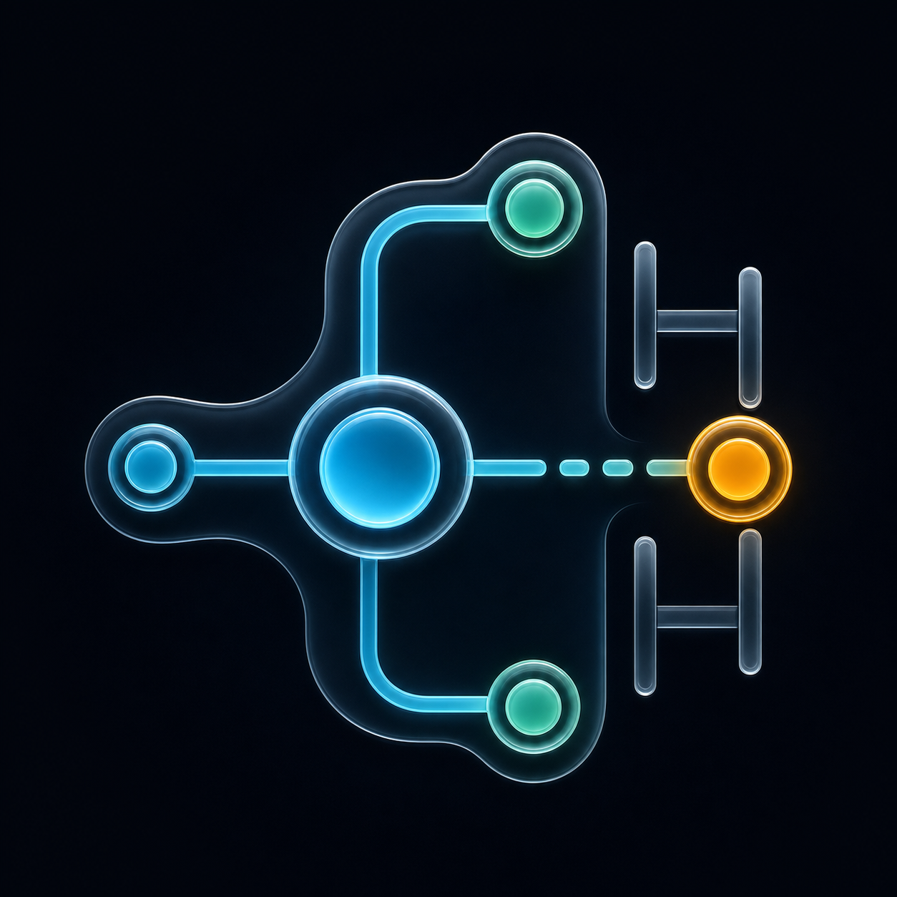
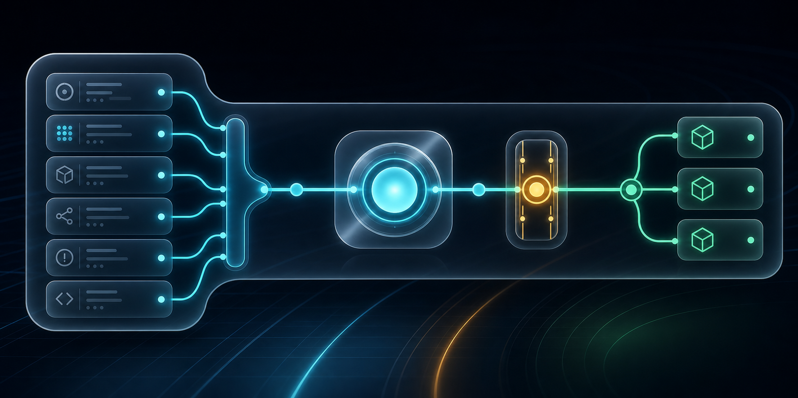

<div align="center">



# Paddock

**Open-source AI software factory control plane.**

Paddock turns GitHub issues, workflow contracts, agent sandboxes, governance
policies, artifacts, and human review gates into one self-hosted operating system
for autonomous software work.

[](LICENSE)
[](https://nextjs.org/)
[](https://typescriptlang.org/)
[](https://github.com/racecraft-lab/Paddock/commits/main)
[](https://github.com/racecraft-lab/Paddock/issues)



</div>

---

> **Alpha software** - Paddock is under active development. APIs, database
> schemas, workflow contracts, and configuration formats may change between
> releases. Review [SECURITY.md](SECURITY.md) before deploying to any
> network-accessible environment.

## Vision

Paddock is evolving from an agent dashboard into an AI software factory
for a **facility -> product line -> department** operating model.

The v1 product vision is defined in [docs/rc-factory-v1-prd.md](docs/rc-factory-v1-prd.md):

- GitHub issues are the source work items for autonomous software work.
- Paddock tasks are synchronized projections enriched with assignment,
  workflow, governance, artifacts, run state, and review metadata.
- Repo-owned workflow contracts define policy and prompts in versioned Markdown,
  then round-trip into runtime `workflow_templates`.
- Each active work item runs in an isolated sandbox or git worktree owned by
  Paddock, OpenClaw, or another explicit harness adapter.
- Aegis, reviewer, governance, and owner gates make autonomous work legible and
  reviewable before merge.
- Existing single-workspace deployments remain supported through feature flags,
  null-default schema changes, and compatibility paths.

Paddock itself is Product Line A for the pilot: its own issues, specs,
workflow contracts, validation evidence, and PRs are the proving ground.

## What It Does Today

- Operates a self-hosted Next.js dashboard for agents, tasks, sessions, skills,
  costs, logs, security posture, workflow contracts, and system health.
- Stores runtime state locally in SQLite with no required Redis or Postgres.
- Syncs with GitHub issues and pull requests for product work intake and
  completion evidence.
- Runs Aegis quality review gates, task pipelines, disposition logging, artifact
  handoffs, and resource governance.
- Exposes REST, CLI, and MCP control interfaces for agents and operators.
- Observes local and gateway-backed harnesses including Codex, Claude Code,
  OpenClaw, Hermes, OpenCode, and compatible adapters.

## Factory Model

| Concept | Paddock meaning |
| --- | --- |
| Facility | Authenticated operating boundary and aggregate view. |
| Product Line | A product workspace, such as Paddock itself. |
| Department | A project area inside a product line, such as QA or Development. |
| Work Item | A GitHub issue synchronized into a Paddock task chain. |
| Workflow Contract | Repo-owned Markdown/YAML policy that seeds runtime templates. |
| Run | One isolated harness attempt attached to a tracked work item. |
| Review Packet | Agent-readable bundle of PR, artifacts, validation, governance, cost, and unresolved human gates. |

## Quick Start

### One-command install

```bash
git clone https://github.com/racecraft-lab/Paddock.git
cd Paddock
bash install.sh --local     # or: bash install.sh --docker
```

Then open the setup flow:

```bash
open http://localhost:3000/setup
```

The installer handles Node.js 22+, pnpm, dependencies, and credential generation.
For Windows, use `.\install.ps1 -Mode local` in PowerShell.

### Manual setup

```bash
git clone https://github.com/racecraft-lab/Paddock.git
cd Paddock
nvm use 22
pnpm install
pnpm dev
```

Open `http://localhost:3000/setup` and create the first admin account.

### Docker

```bash
docker compose up
```

For hardened deployment:

```bash
docker compose -f docker-compose.yml -f docker-compose.hardened.yml up -d
```

## Agent Control

Paddock can be driven from the web UI, REST API, CLI, or MCP server.

```bash
export MC_URL=http://localhost:3000
export MC_API_KEY=your-api-key

# Factory/multi-workspace deployments with FEATURE_WORKSPACE_SWITCHER enabled:
# add workspace_id to POST bodies and queue/read query strings.

curl -X POST "$MC_URL/api/agents/register" \
  -H "Authorization: Bearer <MC_API_KEY>" \
  -H "Content-Type: application/json" \
  -d '{"name": "scout", "role": "researcher"}'

curl -X POST "$MC_URL/api/tasks" \
  -H "Authorization: Bearer <MC_API_KEY>" \
  -H "Content-Type: application/json" \
  -d '{"title": "Research competitors", "assigned_to": "scout", "priority": "medium"}'

curl "$MC_URL/api/tasks/queue?agent=scout" \
  -H "Authorization: Bearer <MC_API_KEY>"
```

For the full walkthrough, see [docs/quickstart.md](docs/quickstart.md).

## Documentation

| Guide | Purpose |
| --- | --- |
| [Factory PRD](docs/rc-factory-v1-prd.md) | Product vision, operating model, requirements, success criteria, and rollout plan. |
| [Factory technical roadmap](docs/ai/rc-factory-technical-roadmap.md) | Spec sequencing and implementation units for the factory architecture. |
| [Quickstart](docs/quickstart.md) | First local setup, agent registration, and task flow. |
| [Agent setup](docs/agent-setup.md) | Agent identities, SOUL personalities, config, and heartbeats. |
| [Orchestration](docs/orchestration.md) | Multi-agent workflows, auto-dispatch, and quality review gates. |
| [Workflow contract](docs/ai/workflows/paddock/workflow-contract.yaml) | Repo-owned workflow policy for Paddock product-line work. |
| [CLI reference](docs/cli-agent-control.md) | Headless and scripted control commands. |
| [CLI integration](docs/cli-integration.md) | Connect Codex, Claude Code, or another CLI harness. |
| [Deployment](docs/deployment.md) | Production deployment, reverse proxy, and VPS guidance. |
| [Security hardening](docs/SECURITY-HARDENING.md) | Docker hardening, CSP, and network isolation. |
| [Feature flags](docs/feature-flags-runbook.md) | Flag behavior, env overrides, activation preflights, and matrix-test conventions. |
| [Resource governance](docs/orchestration.md#spec-008-resource-governance-integration) | Dispatcher admission, governance APIs/UI, and recovery runbook references. |
| [OpenAPI](openapi.json) | REST API contract. Scalar UI is available at `/docs` when running; raw JSON is served from `/api/docs`. |

## Architecture

Paddock remains a TypeScript/Next.js/SQLite application.

```
paddock/
├── src/
│   ├── app/                  # App Router pages and API routes
│   ├── components/           # SPA shell, panels, chat, layout, dashboards
│   ├── lib/                  # DB, auth, migrations, scheduler, workflow logic
│   └── store/                # Zustand state
├── docs/
│   ├── ai/                   # Specs, workflow contracts, roadmap, evidence
│   └── rc-factory-v1-prd.md  # Product source of truth
├── scripts/                  # Install, deploy, diagnostics, workflow tooling
└── .data/                    # Runtime SQLite/state directory, gitignored
```

## Stack

| Layer | Technology |
| --- | --- |
| Framework | Next.js 16 App Router |
| UI | React 19, Tailwind CSS 3 |
| Language | TypeScript 5 |
| Database | SQLite via better-sqlite3 |
| State | Zustand |
| Charts | Recharts |
| Tests | Vitest and Playwright |
| Package manager | pnpm |

## Development

```bash
pnpm dev              # development server
pnpm build            # production build
pnpm typecheck        # TypeScript check
pnpm lint             # ESLint
pnpm test             # Vitest unit tests
pnpm test:e2e         # Playwright E2E tests
pnpm quality:gate     # repository quality gate
```

Diagnostics:

```bash
bash scripts/station-doctor.sh
bash scripts/security-audit.sh
```

## Configuration

See [.env.example](.env.example) for the full environment reference.

| Variable | Purpose |
| --- | --- |
| `AUTH_USER` / `AUTH_PASS` | Optional initial admin credentials. |
| `API_KEY` | Optional headless API key. |
| `PADDOCK_DATA_DIR` | Runtime database and state directory. |
| `MC_ALLOWED_HOSTS` | Production host allowlist. |
| `NEXT_PUBLIC_GATEWAY_OPTIONAL` | Run without a gateway connection. |
| `OPENCLAW_CONFIG_PATH` | Optional OpenClaw gateway configuration path. |
| `OPENCLAW_STATE_DIR` | Optional OpenClaw state directory. |
| `MC_CLAUDE_HOME` | Optional Claude Code data directory. |

## Security

- Change all default credentials before deployment.
- Put any network-accessible deployment behind TLS and an authenticated reverse
  proxy.
- Configure `MC_ALLOWED_HOSTS` before exposing the service outside localhost.
- Treat agent sandboxes, transcripts, artifacts, and workflow contracts as
  sensitive operational state.
- Report vulnerabilities through [SECURITY.md](SECURITY.md).

## Roadmap

The factory roadmap is driven by the PRD and spec archive:

- Product-line and Facility scoping.
- Facility-wide Aegis and security guardians.
- Task pipeline engine and `ready_for_owner` terminal flow.
- Area-label GitHub routing and issue disposition telemetry.
- Shared artifact store and review packets.
- Resource governance for WIP, budget, and blackout/degraded windows.
- GitHub issue runner with isolated sandboxes and harness adapters.
- Post-merge human UAT loop before operational acceptance.

See [docs/rc-factory-v1-prd.md](docs/rc-factory-v1-prd.md) and
[docs/ai/rc-factory-technical-roadmap.md](docs/ai/rc-factory-technical-roadmap.md)
for the canonical sequence.

## Contributing

Contributions are welcome. Start with [CONTRIBUTING.md](CONTRIBUTING.md),
[CODE_OF_CONDUCT.md](CODE_OF_CONDUCT.md), and [SECURITY.md](SECURITY.md).

For architecture work, align proposals with the factory PRD, technical roadmap,
and existing SpecKit workflow records under `docs/ai/specs/`.

## License

Paddock is released under the [MIT License](LICENSE). See the license
file for the full text and historical copyright notice.
